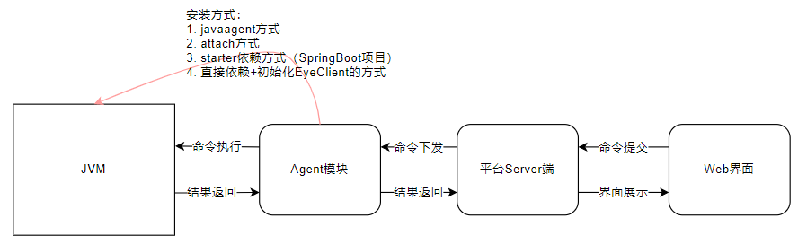
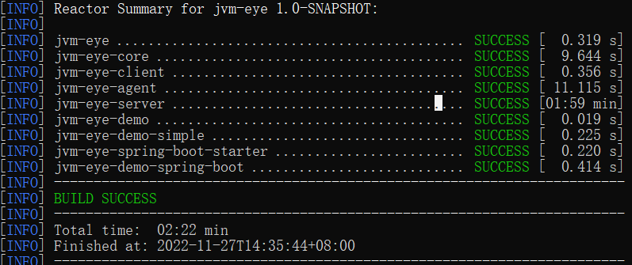
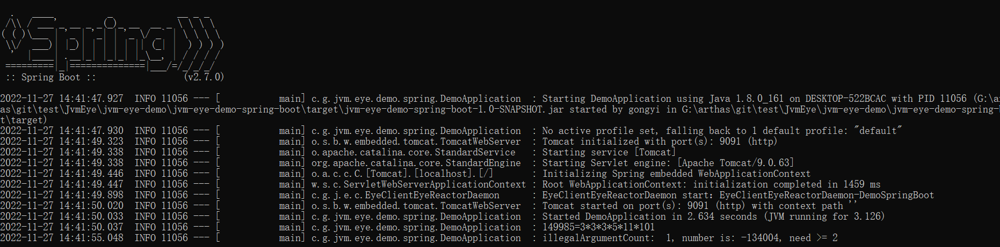
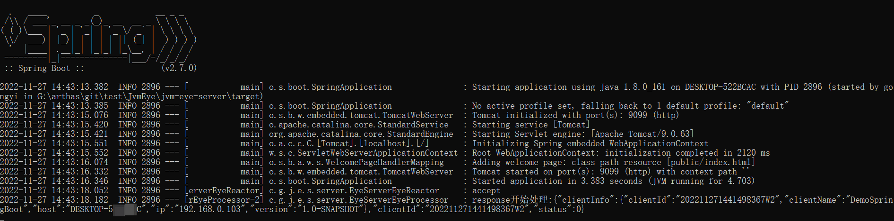
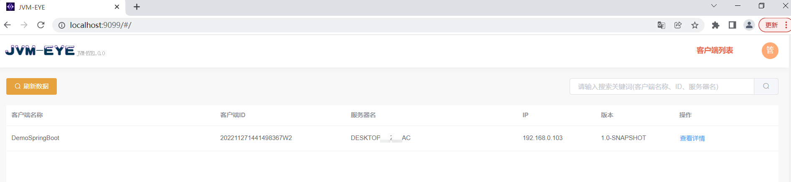
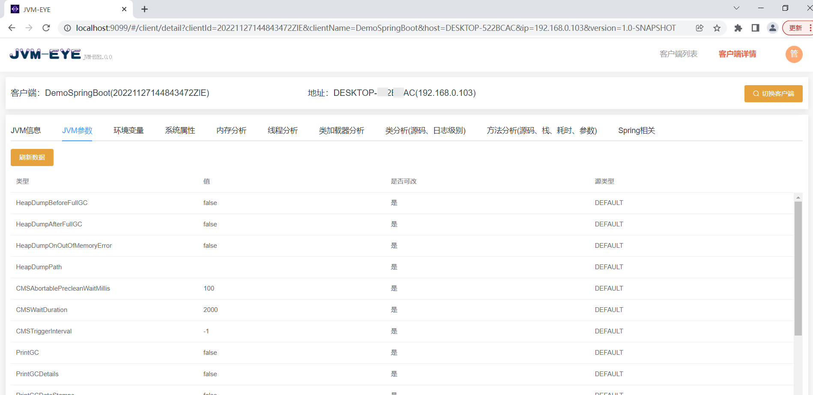
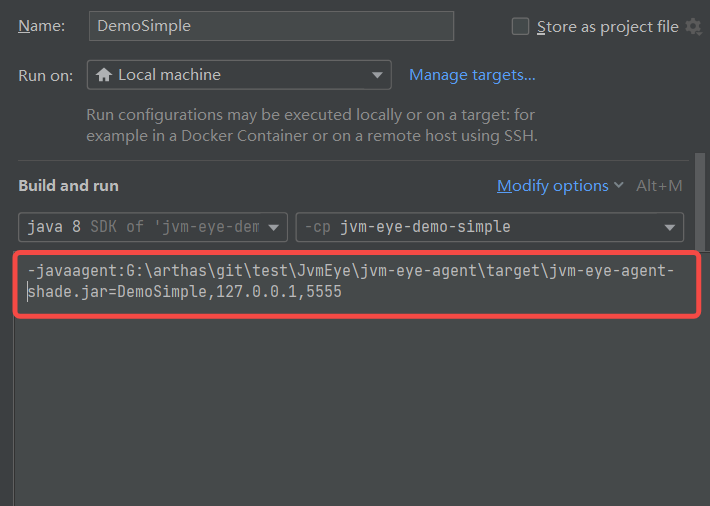
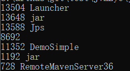
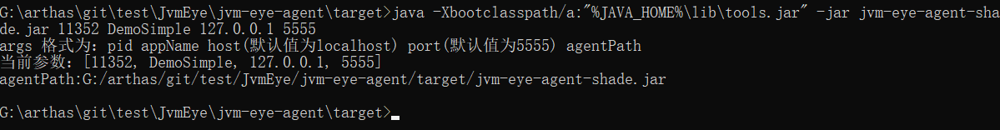

# JvmEye
基于Arthas的命令源码重新架构设计的Java诊断平台，移植了Arthas大部分的诊断命令，大大降低了诊断使用的门槛，实现了可视化的诊断交互，同时优化和封装了一些场景的使用，比如：封装了Spring的资源文件列表查看、Spring的配置信息查看、实例方法的直接调用（结合jrebel热更可以实现零重启的在线调试）等，还有就是watch、trace、stack支持批量客户端在同一个session里面进行展示和清除，并引入了自动检测session是否存在来还原增强的代码。

另外，整个平台的逻辑架构简化，并集成了前端，可以很简单的实现本地编译和构建，构建好的包也能够很简单的进行启动运行，没有任何的第三方依赖，扩展和封装也非常简单。

该平台由个人花费业余时间肝出来的，没有经过系统全面的测试，勿应用于生产环境。平台的登录认证、权限管理以及审计相关都没有实现，有需要的可以自行基于server层进行扩展。

详细说明见CSDN：https://blog.csdn.net/m0_51510818/article/details/128079151


# 平台架构




# 快速体验

### 1. 代码下载和构建

```
git clone https://github.com/gy4j/JvmEye.git
cd JvmEye
mvn clean package
```




### 2. 启动Demo（参考集成方式说明集成自己的应用）

> 占用端口：9091
>

```
cd jvm-eye-demo\jvm-eye-demo-spring-boot\target
java -jar jvm-eye-demo-spring-boot-1.0-SNAPSHOT
```




### 3. 启动Server

> 占用端口：9099，5555
>

```
cd jvm-eye-server\target
java -jar jvm-eye-server-1.0-SNAPSHOT.jar
```




### 4. 访问诊断界面

> 界面地址：http://localhost:9099
>

#### 1. 连接的客户端列表



#### 2. 客户端诊断相关




# 集成方式说明

> 集成后，可以通过诊断界面来观察是否集成成功，成功的话列表里面会出现对应的客户端

### 1. javaagent方式

增加vmoption：-javaagent:G:\arthas\git\test\JvmEye\jvm-eye-agent\target\jvm-eye-agent-shade.jar=DemoSimple,127.0.0.1,5555




### 2. attach方式

> TODO：attach的时候可以参考arthas集成jps命令进行交互式的pid选择


```bash
cd G:\arthas\git\test\JvmEye\jvm-eye-agent\target

java -Xbootclasspath/a:"%JAVA_HOME%\lib\tools.jar" -jar jvm-eye-agent-shade.jar 需要诊断的pid DemoSimple 127.0.0.1 5555
```

例如：

第一步：通过jps获取需要需要诊断的PID

```
jps
```




第二步：执行attach

```bash
cd G:\arthas\git\test\JvmEye\jvm-eye-agent\target
java -Xbootclasspath/a:"%JAVA_HOME%\lib\tools.jar" -jar jvm-eye-agent-shade.jar 11352 DemoSimple 127.0.0.1 5555
```




### 3. starter依赖方式（SpringBoot项目）

参考Demo项目：jvm-eye-demo-spring-boot

增加pom依赖：

```xml
<dependency>
    <groupId>com.gy4j</groupId>
    <artifactId>jvm-eye-spring-boot-starter</artifactId>
    <version>1.0-SNAPSHOT</version>
</dependency>
```

增加配置项：

```yaml
spring:
  application:
    name: DemoSpringBoot # clientName
jvm:
  eye:
    host: localhost # server的ip
    port: 5555 # server的port
    enable: true # 是否开启诊断，默认false
```


### 4. 直接依赖+初始化EyeClient的方式

参考Demo项目：jvm-eye-demo-simple

增加pom依赖：

```xml
<dependency>
    <groupId>com.gy4j</groupId>
    <artifactId>jvm-eye-client</artifactId>
    <version>1.0-SNAPSHOT</version>
</dependency>
```

增加代码初始化EyeClient：

```java
// 指定clientName为DemoSimple，指定server的ip（localhost）和port（5555）
new EyeClient(ByteBuddyAgent.install(), "DemoSimple", "localhost", 5555);
```


# 本地开发

### 代码结构说明

| 模块名                      | 模块说明                                                     |
| --------------------------- | ------------------------------------------------------------ |
| jvm-eye-agent               | javaagent和jvm attach的启动模块，使用方式参考集成方式说明    |
| jvm-eye-client              | NIO client模块，用于和server端通信                           |
| jvm-eye-core                | 核心的逻辑模块，所有工具类、命令相关封装、接口封装等         |
| jvm-eye-server              | NIO server模块，用于和client端通信，占用端口：5555<br />Web后台模块，用于和web端交互，包括http和websocket，占用端口：9099 |
| jvm-eye-spring-boot-starter | starter封装，用于SpringBoot项目的快速集成                    |
| jvm-eye-ui                  | 前端，基于vue2+ElementUI实现，满足可视化的诊断需求，占用端口：8080（本地启动占用，打包后集成到jvm-eye-server里面共用9099端口） |
| jvm-eye-demo-simple         | 简单的DEMO项目，同于调试集成方式和命令功能                   |
| jvm-eye-demo-spring-boot    | 基于SpringBoot starter集成的DEMO项目，用于调试集成方式和命令功能，占用端口：9091 |

### 本地开发说明

1. 启动EyeServerApplication（占用端口：9099和5555）

2. jvm-eye-ui目录下启动前端：npm run serve（占用端口：8080）

3. 启动待诊断项目（使用DEMO项目，或者参考集成方式集成自己的待诊断项目，最好选用集成方式3或者4，方便断点调试）

4. 访问诊断界面 http://localhost:8080 进行验证和功能开发

   

# Arthas命令对比说明

| 命令名称    | 命令类型 | 完成状态 | Command                              | 前端集成                                             |
| ----------- | -------- | -------- | ------------------------------------ | ---------------------------------------------------- |
| watch       | Times    | 是       | WatchCommand                         | 已集成                                               |
| vmoption    | RealTime | 是       | VmOptionCommand                      | 已集成                                               |
| version     | RealTime | 是       | ClientInfoCommand                    | 已集成                                               |
| trace       | Times    | 是       | TraceCommand                         | 已集成                                               |
| thread      | RealTime | 是       | ThreadAllCommand                     | 已集成                                               |
| sysprop     | RealTime | 是       | SysPropCommand                       | 已集成                                               |
| sysenv      | RealTime | 是       | SysEnvCommand                        | 已集成                                               |
| stack       | Times    | 是       | StackCommand                         | 已集成                                               |
| sm          | RealTime | 是       | MethodCommand                        | 已集成                                               |
| sc          | RealTime | 是       | ClassCommand                         | 已集成                                               |
| reset       | RealTime | 是       | ResetCommand                         | 已集成                                               |
| ognl        | RealTime | 是       | OgnlCommand                          | 不集成                                               |
| memory      | RealTime | 是       | MemoryCommand                        | 已集成                                               |
| logger      | RealTime | 是       | LoggerLevelCommand LoggerInfoCommand | 已集成                                               |
| jvm         | RealTime | 是       | JvmCommand                           | 已集成                                               |
| jad         | RealTime | 是       | JadCommand                           | 已集成                                               |
| heapdump    | File     | 是       | HeapDumpCommand                      | 已集成                                               |
| classloader | RealTime | 是       | ClassLoaderCommand                   | 已集成                                               |
| vmtool      | RealTime | 是       | VmToolCommand                        | 不直接集成，封装Spring配置和资源查询、实例方法调用等 |

