# 功能介绍

> 现有功能的使用截图在下面一个个截图展示了，整个平台具备了访问JVM底层信息和对象实例的能力，可以基于这些基础能力开发出更多定制化提高开发效率、诊断效率的高级能力。

CSDN博客：

[JvmEye-一款基于Arthas重构的Java诊断平台](https://blog.csdn.net/m0_51510818/article/details/128079151?spm=1001.2014.3001.5501)

[JvmEye-功能介绍](https://blog.csdn.net/m0_51510818/article/details/128081698?spm=1001.2014.3001.5501)

## JVM信息

> 获取JVM的相关信息：运行时信息、编译器信息、内存管理信息、内存信息、垃圾回收信息、线程信息、类加载信息、操作系统信息、文件描述符信息。

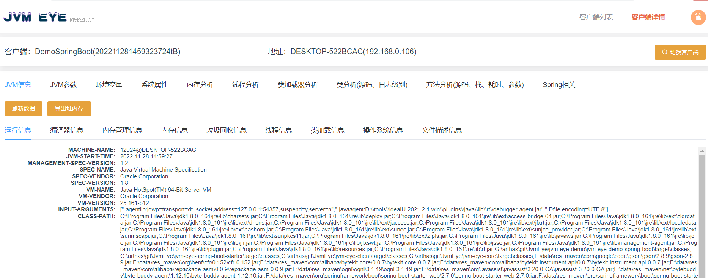

> 导出堆内存（当内存占用过大的时候，可以通过导出堆内存进行后续分析）

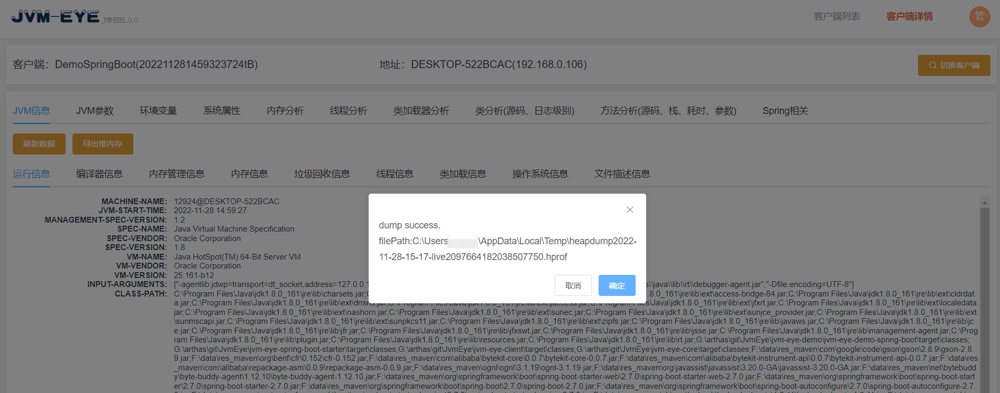

## JVM参数

> 查看JVM相关的参数配置。

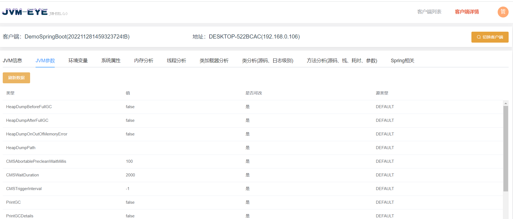

## 环境变量

> 操作系统的环境变量配置信息。

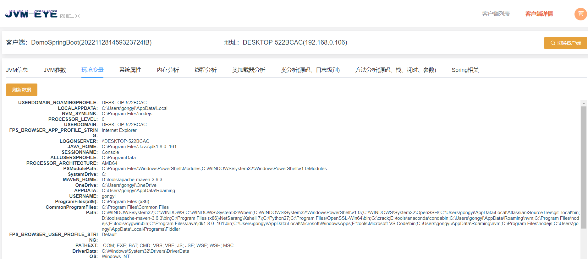

## 系统属性

> 查看JVM的系统配置属性。

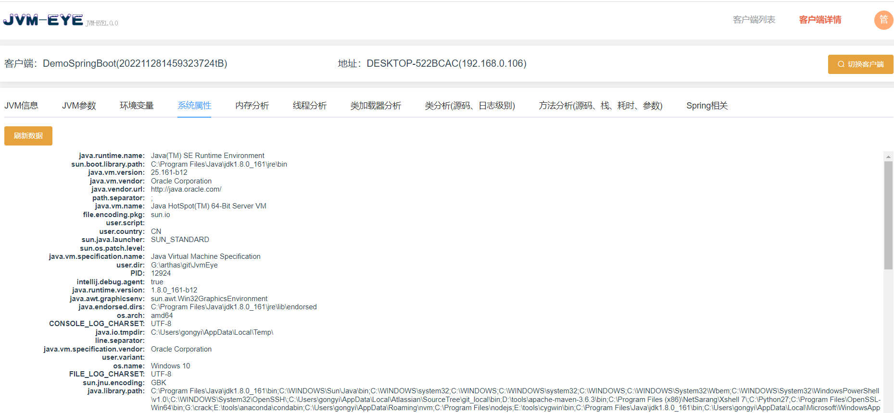

## 内存分析

> 查看JVM的内存使用情况，各个空间的大小。

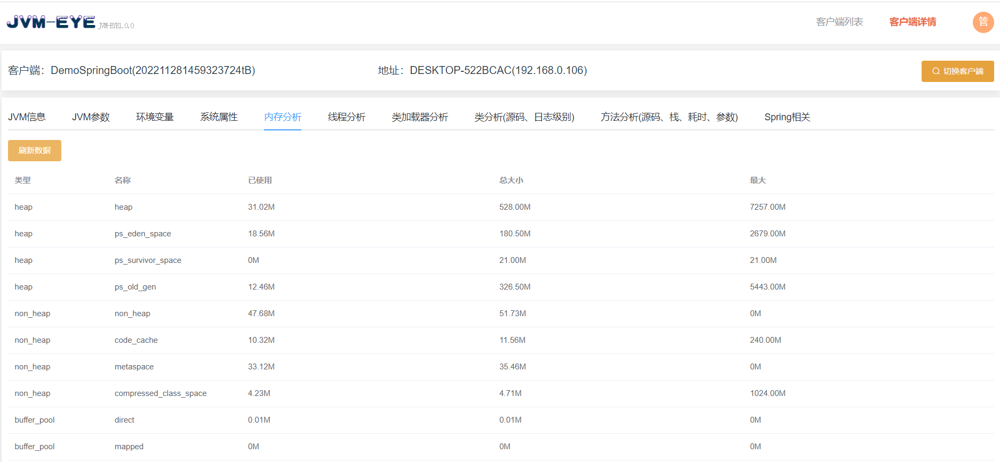

## 线程分析

> 查看线程的CPU占用情况，本机应用启动较多，cpu消耗比较大，关于线程耗时计算的逻辑参考[arthas的thread使用手册](https://arthas.aliyun.com/doc/thread.html)

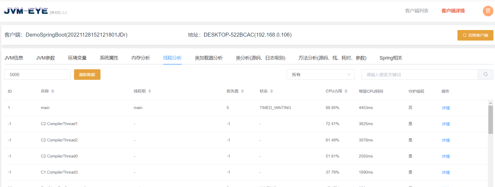

> 查看线程的详细信息和堆栈

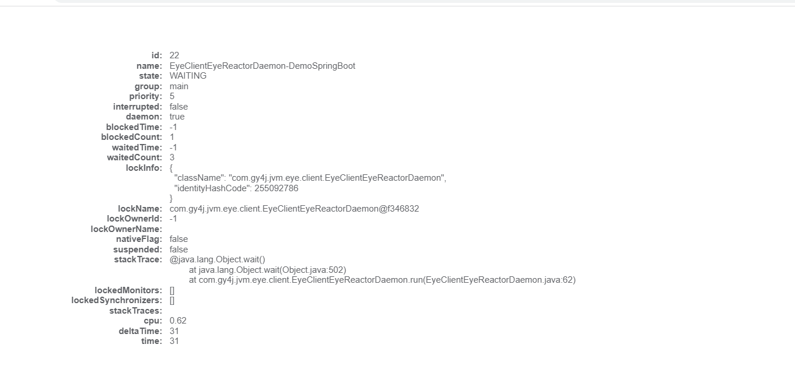

## 类加载器分析

> 查看类加载器的基本信息。

## 类分析(源码、日志级别)

### 查看类列表

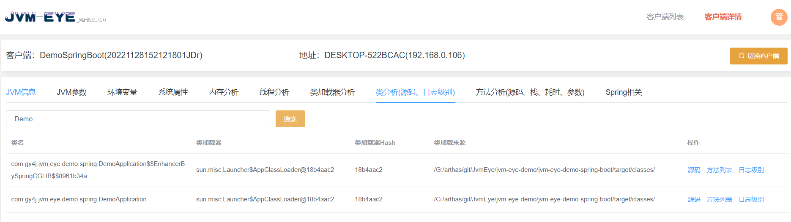

### 查看类源码

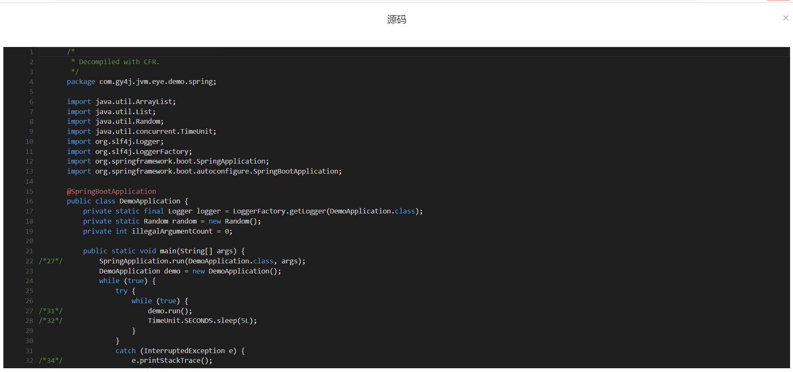

### 查看并调整类的日志级别

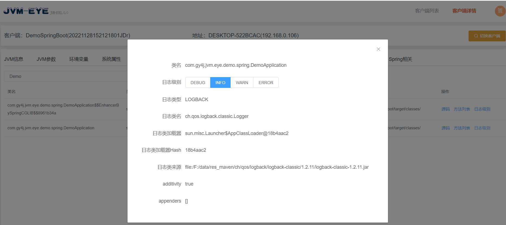

### 查看类的方法列表

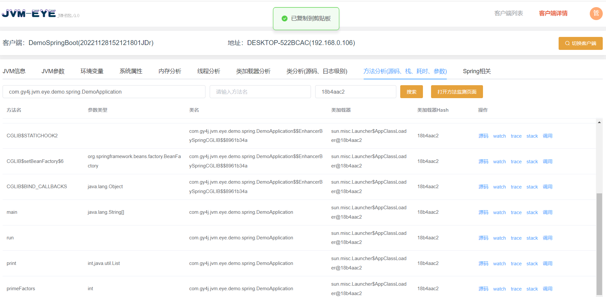

## 方法分析(源码、栈、耗时、参数)

### 查看方法列表

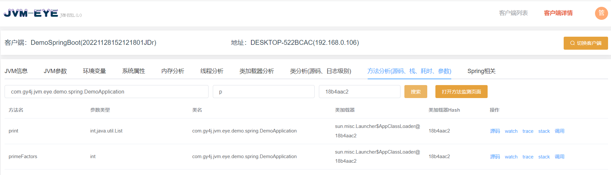

### 查看方法源码

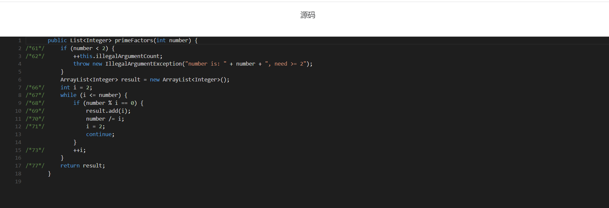

### stack：查看方法的调用栈

> ognl表达式的使用参考[arthas的ognl使用手册](https://arthas.aliyun.com/doc/ognl.html)

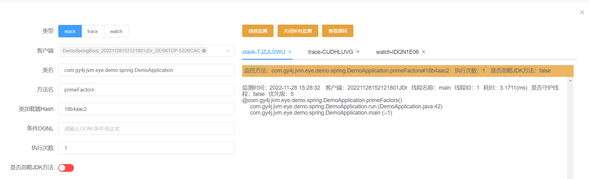

### trace：查看方法以及方法内调用的耗时，

> ognl表达式的使用参考[arthas的ognl使用手册](https://arthas.aliyun.com/doc/ognl.html)

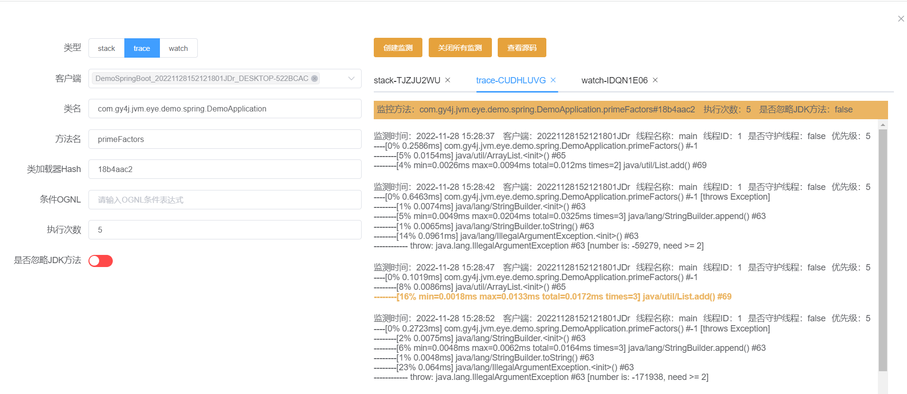

### watch：查看方法调用的入参、返回和异常等

> ognl表达式的使用参考[arthas的ognl使用手册](https://arthas.aliyun.com/doc/ognl.html)

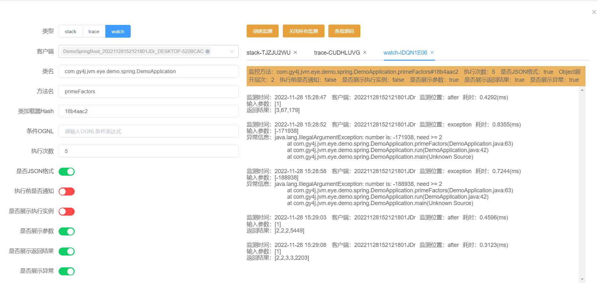

### 方法调用：从JVM中获取对应类的实例进行方法调用

> 实践：结合jrebel的代码热更，可以把这里当成一个触发的入口实现Java项目的零重启热更开发，开发效率杠杠的。因为这里触发的方法调用相当于使用Spring的Bean进行方法调用，具备Spring上下文的内容，不需要我们使用postman等工具去维护一堆的header信息调用controller层再调用service层，可以直接触发对应service服务的调用调试，入参可以通过硬编码结合jrebel进行快速开发和热更调试，避免Spring应用重启产生的耗时。

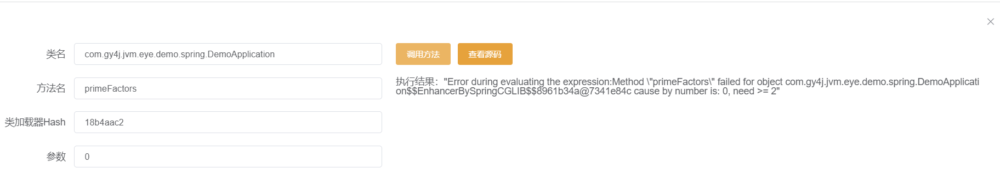

## Spring相关

### 查看Spring的配置项信息

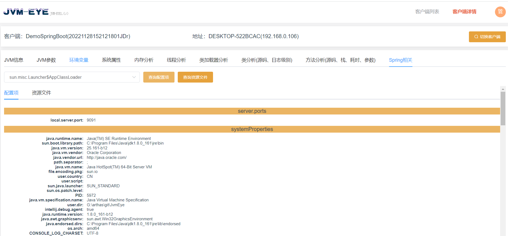

### 查看Spring的资源文件信息

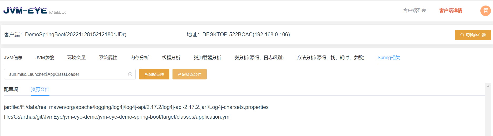

