# JvmEye-实例用例

> 基于JvmEye快速查看JVM信息、快速分析CPU、内存、线程的相关问题，提供快速调试和诊断方法的可视化操作，本节从实践的角度整理了一些用例，快速了解JvmEye实现的可视化诊断功能。


CSDN博客：

[JvmEye-实践用例](https://blog.csdn.net/m0_51510818/article/details/128174480?spm=1001.2014.3001.5502)


# 思考问题

你了解JVM的信息情况吗？从哪里去获取JVM的如下相关信息呢？比如：启动和运行时的信息、JVM参数、环境变量、系统属性。

你了解JVM里面内存的占用情况吗？可以通过什么方式去查看JVM的内存占用情况？如果内存占用很高，你知道怎么样进行分析吗？

你了解JVM里面线程池和线程的情况吗？如果线程cpu-100%了，你知道怎么样进行分析和定位吗？有线程阻塞了，你知道怎样分析线程阻塞在哪里了吗？

你了解JVM里面包括哪些类加载器吗？这些类加载器的层级关系是怎么样的？

当你觉得你修改的代码可能没有发布时，怎么办？类当前的日志级别是什么？用的什么日志框架？日志级别好像设置高了，该有的日志不打印了，怎么办？

你想在非本地环境调试方法的调用栈怎么办？怎样观测方法调用的入参、返回和异常呢？

当你发现某个方法的执行耗时比较高时，怎么办？

当你每次修改代码、修改mapper.xml文件都需要重启服务器，等好几分钟才能启动完成怎么办？当你想快速调用service的某个方法进行调试，怎么办？

你知道Spring加载了哪些配置文件？配置文件里面加载了哪些配置属性？

# 实践用例

## 用例01：线程cpu-100%

### 代码：

```Java
private static boolean cpuTestFlag = false;

public ThreadTestController() {
    Thread thread = new Thread(new Runnable() {
        @Override
        public void run() {
            while (true) {
                doLoopForTestCpu();
                try {
                    TimeUnit.SECONDS.sleep(5);
                } catch (InterruptedException e) {
                }
            }
        }
    });
    thread.setName("ThreadTestController-TestThread");
    thread.start();
}

public void doLoopForTestCpu() {
    while (cpuTestFlag) {
        double a = Math.random();
        double b = Math.random();
        double c = a + b;
    }
}


@RequestMapping("startCpuTest")
public String startCpuTest() {
    cpuTestFlag = true;
    return "startCpuTest";
}

@RequestMapping("stopCpuTest")
public String stopCpuTest() {
    cpuTestFlag = false;
    return "stopCpuTest";
}
```

### 观测步骤：

1. 观测线程：ThreadTestController-TestThread的情况

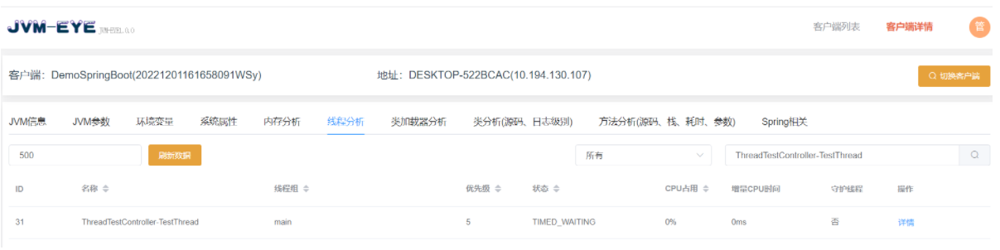

2. 调用startCpuTest，设置 cpuTestFlag=true

3. 观测线程：ThreadTestController-TestThread的情况

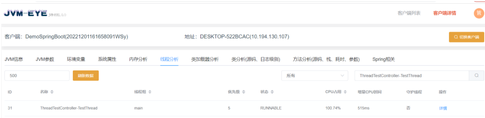

4. 调用stopCpuTest，设置 cpuTestFlag=false

5. 观测线程：ThreadTestController-TestThread的情况

   

## 用例02：线程阻塞

### 代码：

```Java
@RequestMapping("wait01")
public String wait01() {
    String msg = "wait01";
    synchronized (this) {
        try {
            // 阻塞600秒
            TimeUnit.SECONDS.sleep(600);
        } catch (InterruptedException e) {
        }
        System.out.println(msg);
    }
    return "wait01";
}

@RequestMapping("wait02")
public String wait02() {
    String msg = "wait02";
    synchronized (this) {
        System.out.println(msg);
    }
    return "wait02";
}
```

### 观测步骤：

1. 调用wait01

1. 调用wait02

1. 观测线程情况：wait01的线程情况

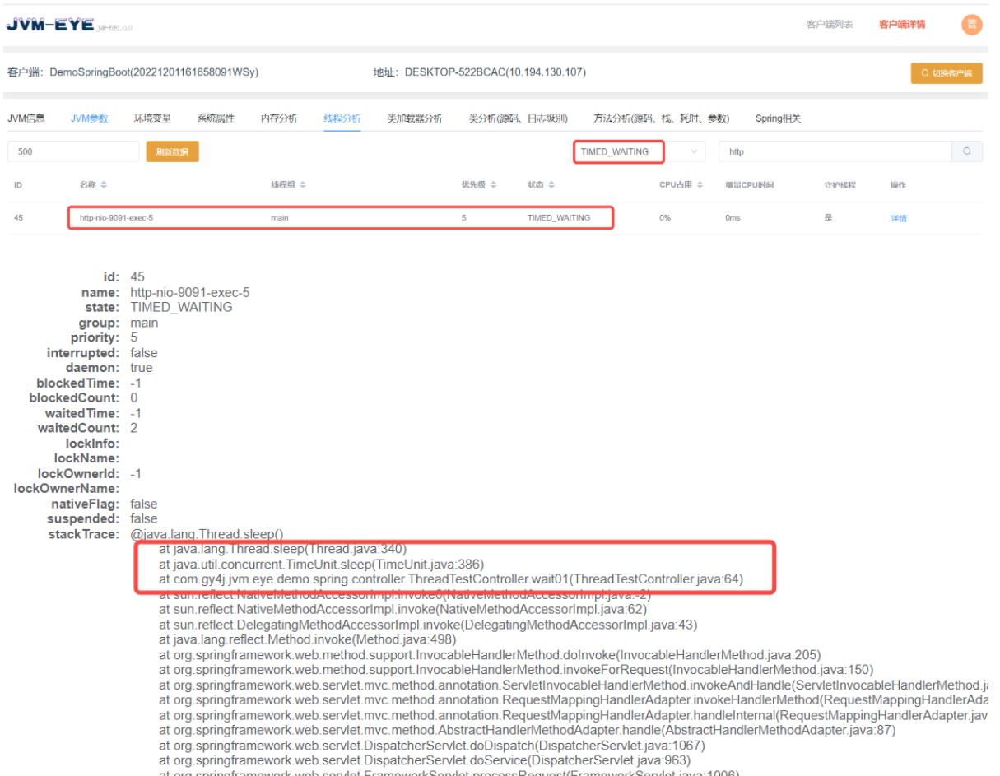


4. 观测线程情况：wait02的线程情况

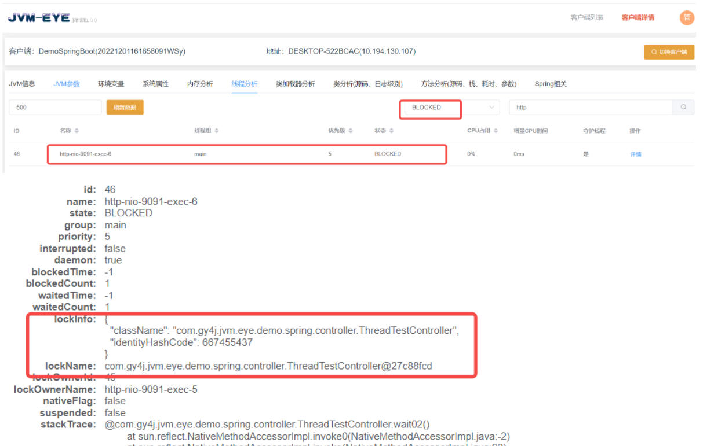


## 用例03：大内存占用

### 代码：

```Java
@RestController
@RequestMapping("test/memory")
public class MemoryTestController {
    private List<String> stringList = new ArrayList<>();

    @RequestMapping("startMemoryTest")
    public String startMemoryTest() {
        stringList.clear();
        for (int i = 0; i < 1000000; i++) {
            stringList.add(new String("testSting" + i));
        }
        return "startMemoryTest";
    }


    @RequestMapping("stopMemoryTest")
    public String stopMemoryTest() {
        stringList.clear();
        return "stopMemoryTest";
    }
}
```

### 观测步骤：

1. 观测内存情况

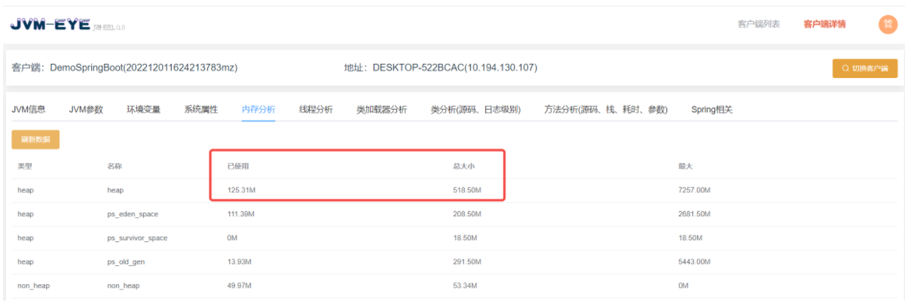

2. 调用startMemoryTest

3. 观测内存情况

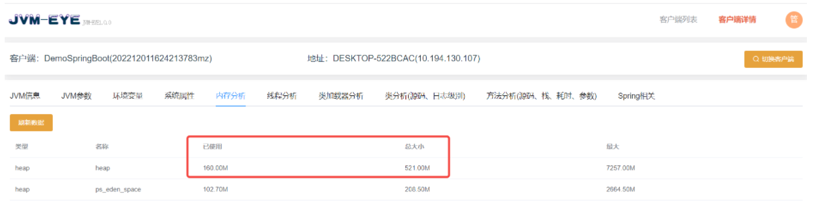

4. 导出堆栈分析

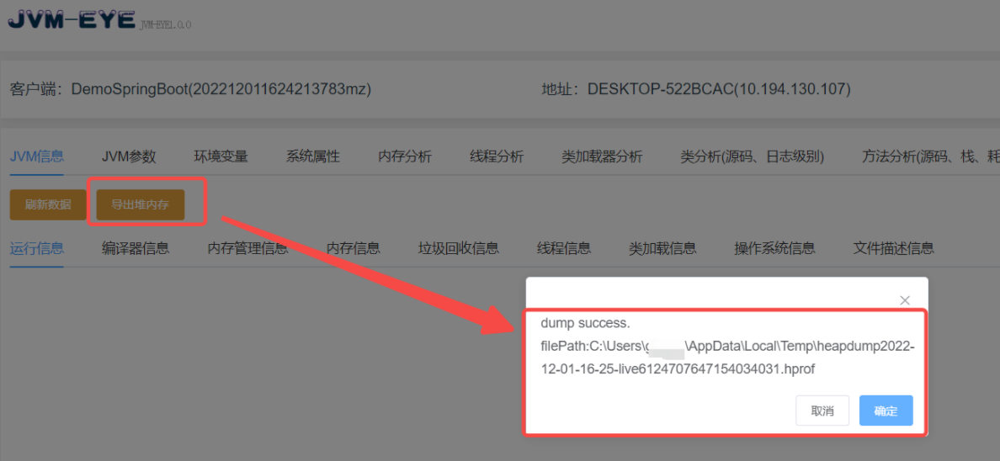

使用idea打开该文件：可以定位到MemoryTestController里面的ArrayList

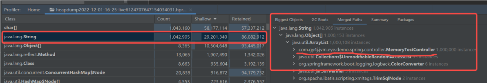


5. 调用stopMemoryTest

6. 观测内存情况

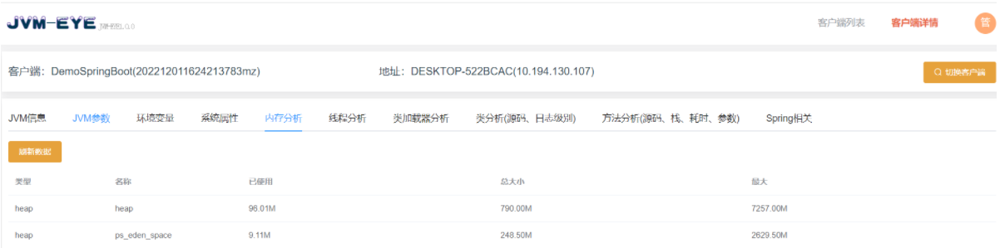

## 用例04：源码查看和日志级别查看并修改

### 代码：

```Java
@RestController
@RequestMapping("test/logger")
public class LoggerTestController {
    private static final Logger logger = LoggerFactory.getLogger(LoggerTestController.class);

    @RequestMapping("testLogger")
    public void testLogger() {
        logger.debug("debug message");
        logger.info("info message");
        logger.warn("warn message");
        logger.error("error message");
    }
}
```

### 观测步骤：

1. 查看日志级别


2. 调用testLogger

   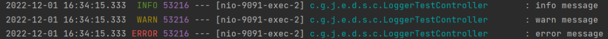


3. 修改日志级别

   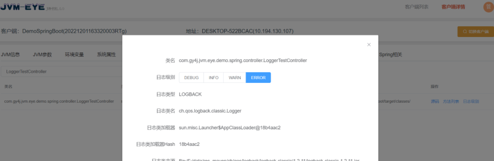


4. 调用testLogger


## 用例05：方法调用栈观测

### 代码：

```Java
@RequestMapping("testStack")
public void testStack() {
    methodTestService.call01();
}
public void call01() {
    this.call02();
}

public void call02() {

}

public void call03() {
    System.out.println("call01-->call02-->call03");
}
```

### 观测步骤：

1. 搜索方法

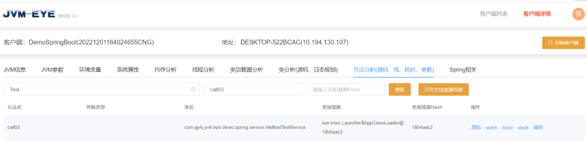

2. 创建stack监测

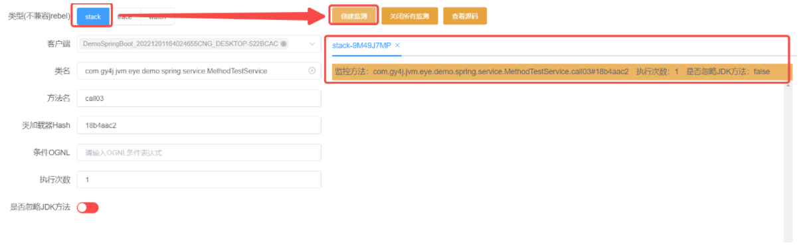

3. 调用testStack

4. 界面查看观测结果

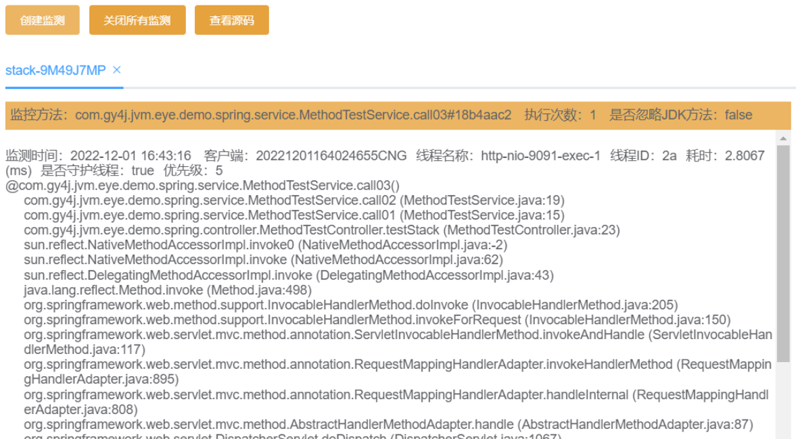


## 用例06：方法调用耗时观测

### 代码：

```Java
@RequestMapping("testTrace")
public void testTrace() {
    for (int i = 0; i < 5; i++) {
        this.sleep100ms();
    }
    this.sleep200ms();
    this.sleep200ms();
    this.sleep200ms();
    this.sleep450ms();
}
```

### 观测步骤：

1. 搜索方法

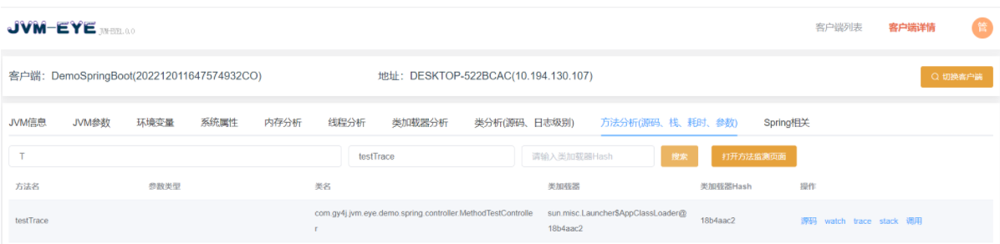

2. 创建trace监测

   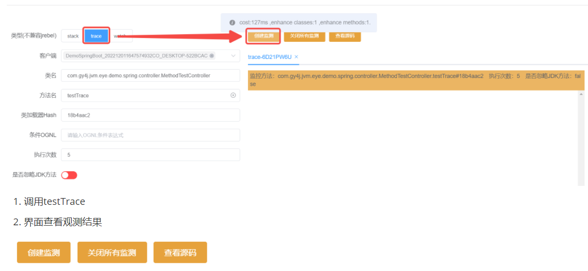


3. 调用testTrace

4. 界面查看观测结果

   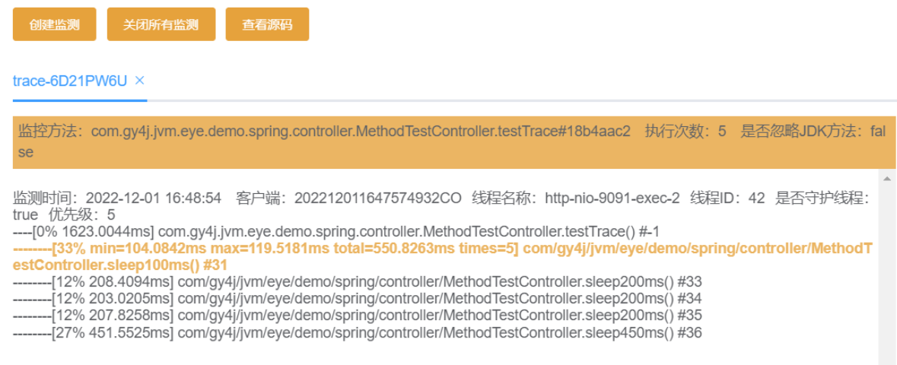


## 用例07：方法入参、返回结果以及异常抛出观测

### 代码：

```Java
@RequestMapping("testWatch")
public String testWatch(@RequestParam("type") String type,
                        @RequestParam("msg") String msg) {
    if ("return".equals(type)) {
        return "test return:" + msg;
    } else if ("throw".equals(type)) {
        throw new RuntimeException("test throw:" + msg);
    }
    return "unknown type" + type;
}
```

### 观测步骤：

1. 搜索方法

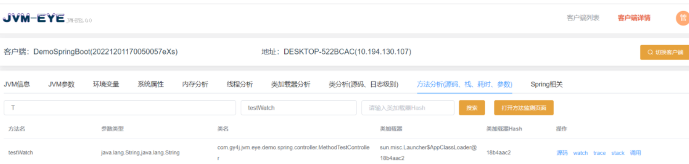

2. 创建watch监测

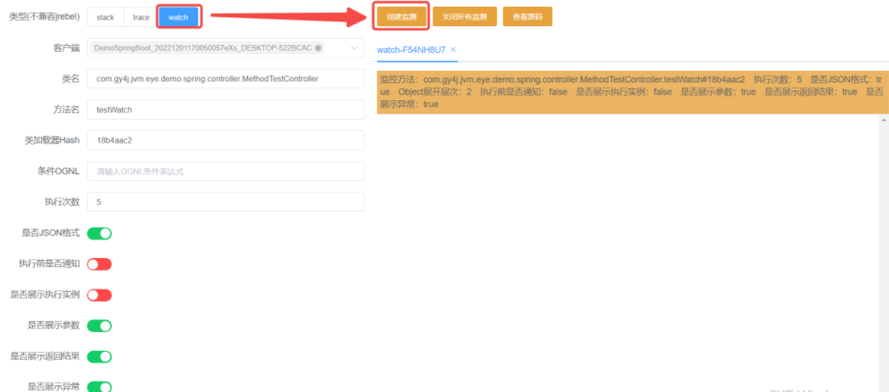

3. 调用testWatch?type=return&msg=TestReturn

4. 调用testWatch?type=throw&msg=TestThrow

5. 界面查看观测结果

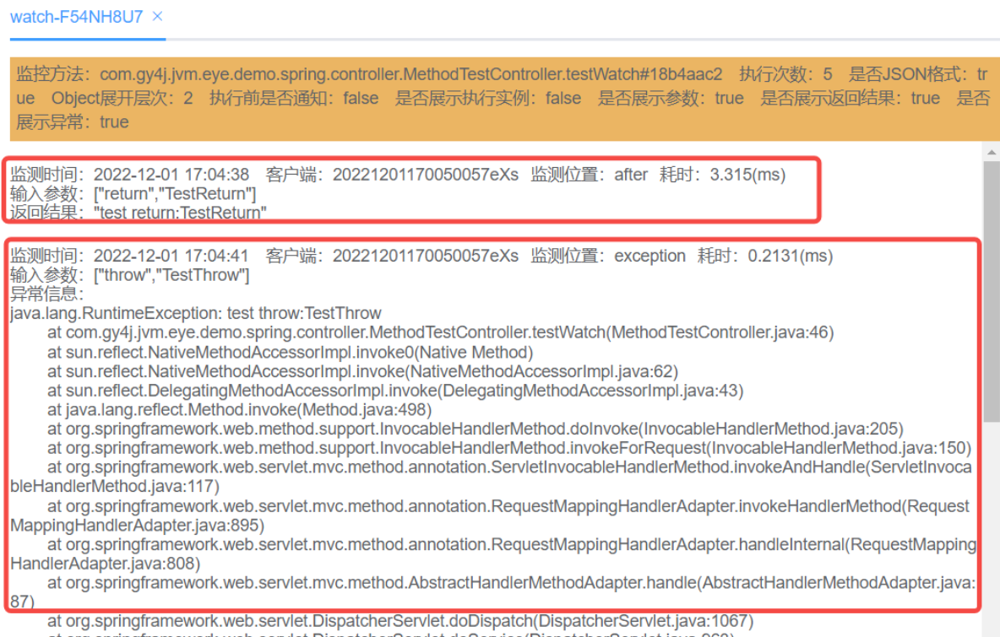


## 用例08：jrebel+方法调用实现零重启开发调试

- ### **Jrebel的安装自行度娘**

- ### **Jrebel支持如下热更场景**

  - 新增方法
  - 新增属性
  - 新增mapper方法
  - mapper.xml文件的修改

- ### **采用JvmEye触发方法调用**

  - 代码：

  - ```Java
    @RequestMapping("testCall")
    public String testCall(String msg) {
        System.out.println(msg);
        return "modified msg:" + msg;
    }
    ```

  - 采用jrebe的debug模式启动开发项目

  - 搜索方法

  - 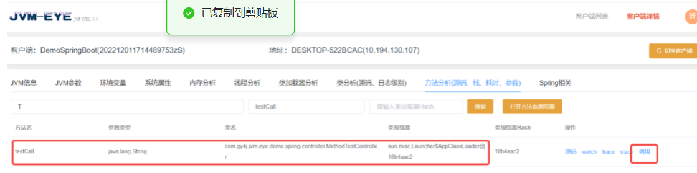

  - 触发调用

  - 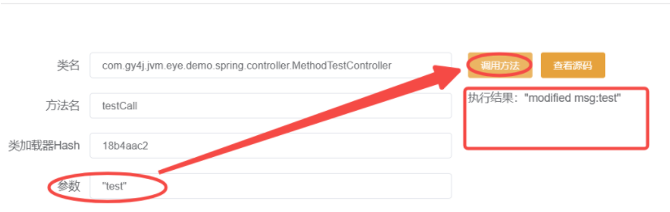

  - 修改代码触发jrebel热更，再次调用

  - 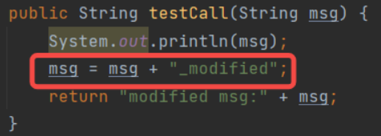

  - 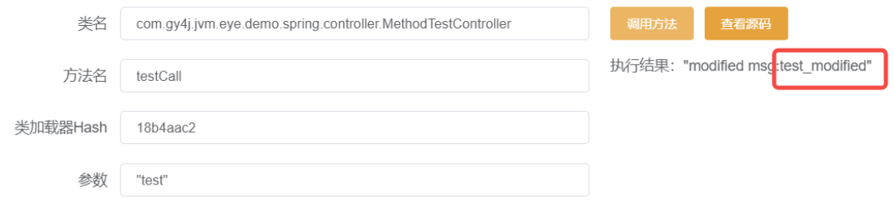


